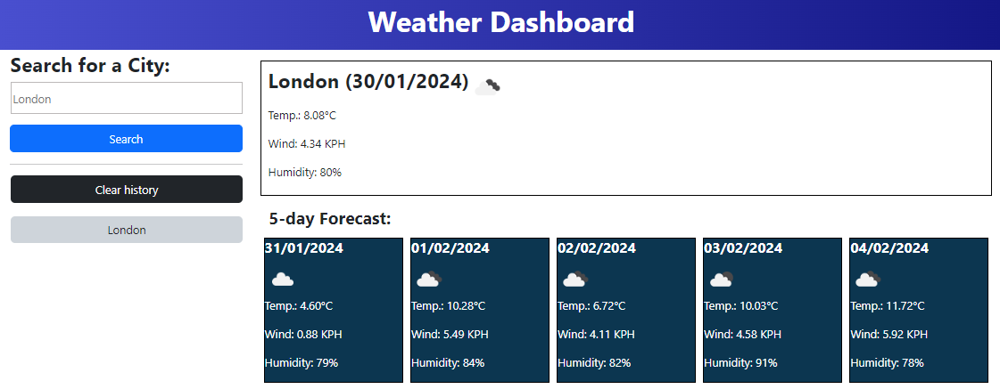
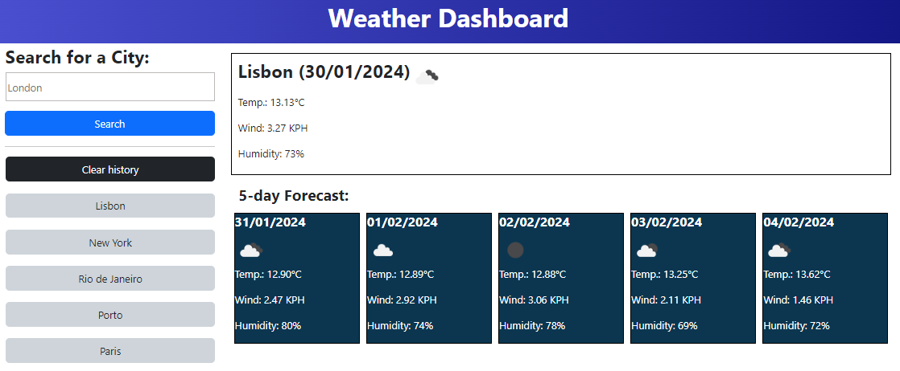
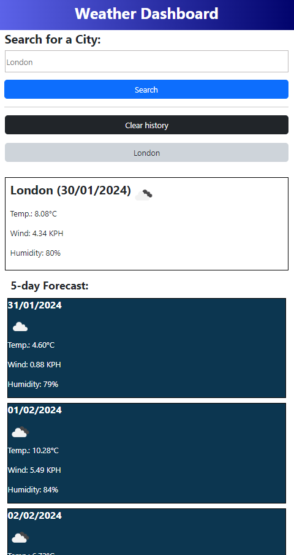

# Weather-Dashboard---edX-Bootcamp-Challenge-8
5 day city weather forecast

This repository contains my answer to the Module 8 Challenge of the Web Development edX bootcamp: https://jpquental90.github.io/Weather-Dashboard---edX-Bootcamp-Challenge-8/

## Description

My task was to create a weather dashboard app which allows the user to search the weather outlook of multiple cities, displaying today's weather as well as a 5-day forecast. Some starter code was provided by edX in a HTML file. A gif demonstrating the desired look of the final product was provided as a guide. 

## Table of Contents

* [Installation](#installation)
* [Usage](#usage)
* [Code](#code)
* [Credits](#credits)
* [License](#license)

## Installation

N/A

## Usage

#### Overall look of the app

The current weather displays on the top right, and 5-day forecast displays on the bottom right. On the left side we have the search field in which a user can type a city name. 

---
#### Storage function

On the bottom left, there is a history panel displaying the most recent 5 searches (which can be immediately clicked again for ease of use) and a 'Clear history' button in case the user wants to clear up their dashboard.

---
#### Responsiveness:

The display is automatically adjusted to different screen sizes.

## Code

In order to apply the knowledge developed in recent classes, I used the weather API and jQuery as much as possible. The bulk of the work was on JavaScript, with some CSS adjustments as well.

## Credits

I have used Google to research the tools I needed for this challenge. I consulted 'getbootstrap.com', the bootcamp info page on how to use API keys and used the Open Weather API. I had a tutoring session on the 28th January 2024. I also consulted some of the material from the edX bootcamp classes.

## License

Licensed under the MIT license.